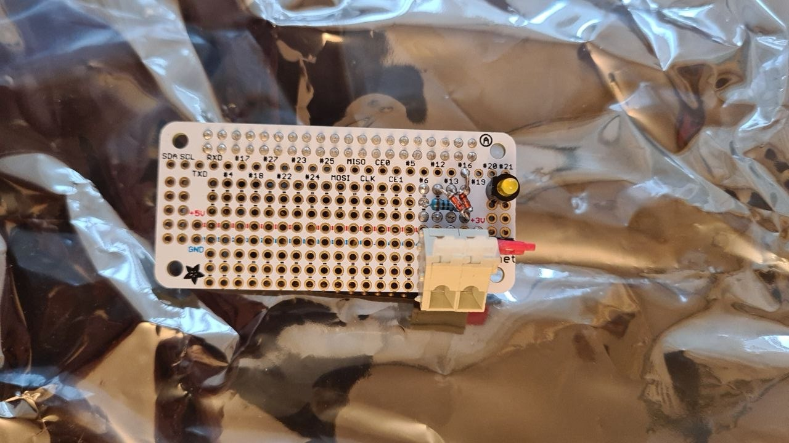
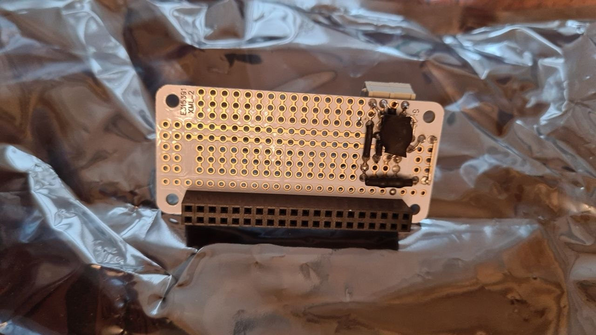

<!-- SPDX-License-Identifier: CC-BY-SA-4.0 -->

# dumb-meter-interface

An electrical interface design to connect pulse outputs of consumption meters, e.g. reed switches, to GPIO inputs of,
e.g. a raspberry pi (RPi).

## Task Overview

The original goal was to interface an [electricity](docs/electricity_meters.md), [gas](docs/gas_meters.md), and [water meters](docs/water_meters.md) in a higher consumption
household to a smart metering solution, like [Volkszähler](https://volkszaehler.org/). An auxiliarly goal was to add a time signal read by a
[DCF-77](https://en.wikipedia.org/wiki/DCF77) [radio module](docs/time_meters.md) to the metering solution.

## GPIO to Sensor Interfaces
We currently interface to reed switches only, but the implementation of more sensor types are envisioned.

### Reed Switches
The main task of the hardware interface is to protect the GPIO line from sustained under- or over-voltage (due to
miswiring, e.g.), overcurrent (misconfiguration of an input as output), and transient overvoltage (electrostatic
discharge, lightning-induced surge). Also, because reed switches (SW) bounce, a hardware debouncing is implemented.

We employ negative logic, i.e. open SW corresponds to the high state (3.3 V, HIGH) of the GPIO line and closed SW
corresponds to the low state (0V, LOW) of the GPIO line. To that end, one connector of the SW is grounded and the other
one, is pulled-up by a 47k Ohm resistor. We shall call the pulled-up end IN_n.

Parallel to the reed switch connector, a 10nF ceramic capacitor implements the debouncing: The RC time constant is
0.47ms, so, on power-up, the capacitor charges within a few milliseconds to 3.3V and IN_n becomes high. When SW is
triggered, the capacitor is almost immediately discharged, because IN_n is grounded over the SW. We observe a falling
edge on IN_n. Once SW is released, the capacitor begins charging and reaches the upper boundary of
[0.8V](https://forums.raspberrypi.com/viewtopic.php?t=55039) for LOW after 0.62ms. Re-triggering SW during this time
period will again discharge the capacitor but not result in a rising edge on IN_n. After 0.78ms from the last time SW
was triggered, IN_n reaches the lower boundary of 1.3V for HIGH signals and we observe a rising edge.

To protect from overcurrent, a 1k Ohm resistor is placed between IN_n and GPIO. Over- and under-voltage protection is
implemented by a pair of Schottky clamp diodes: Ground clamp sits between GPIO and GND and is reverse-biased, when GPIO
is HIGH. The supply clamp sits between GPIO and +3.3V and is reverse-biased, when GPIO is LOW. During normal operation,
both diodes block. When GPIO is 0.4V over 3.3V line, supply clamp conducts and clamps GPIO to the supply line. When GPIO
is below -0.4V the ground clamp conducts.

The clamps and the current-limiting resistor also implement the transient overvoltage protection by dissipating
erroneous input power.

 
The two pictures above show the interface implemented on an Adafruit’s
[Perma Proto Bonnet Mini Kit](https://www.adafruit.com/product/3203). In addition to implementing the measures of
protection, it also features a debugging LED, which can be deactivated with a jumper.