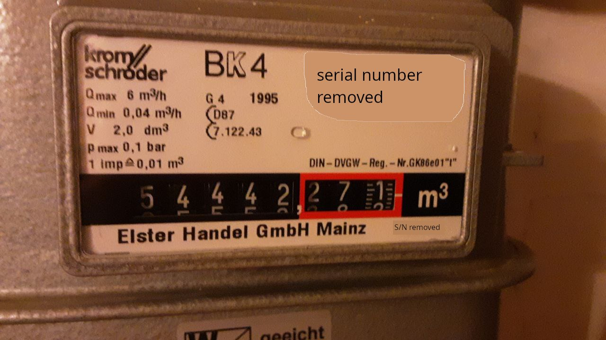
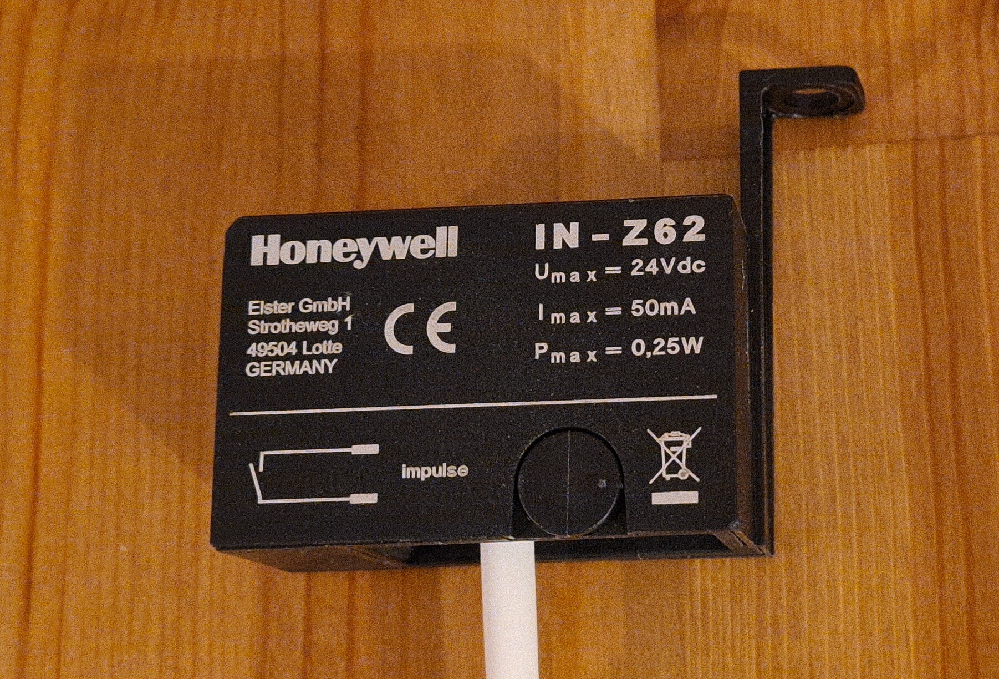
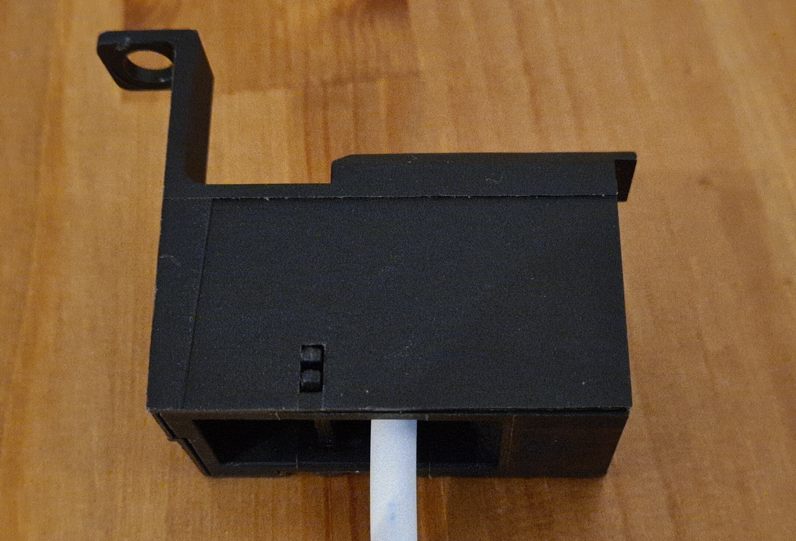
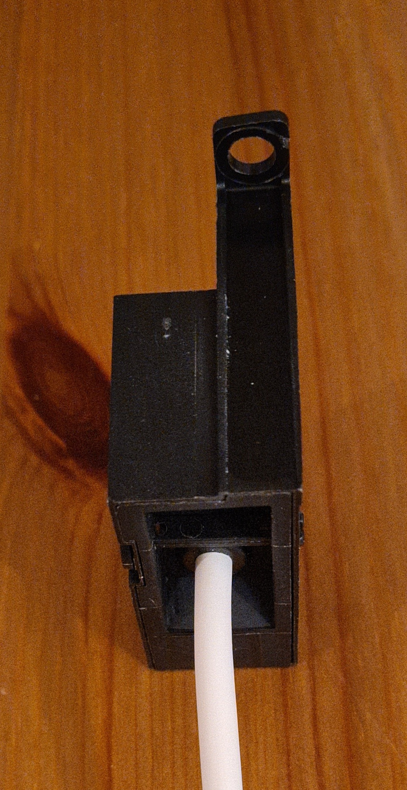
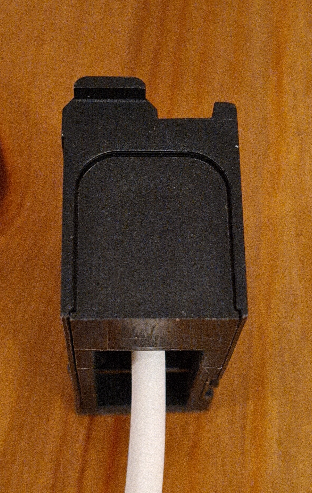
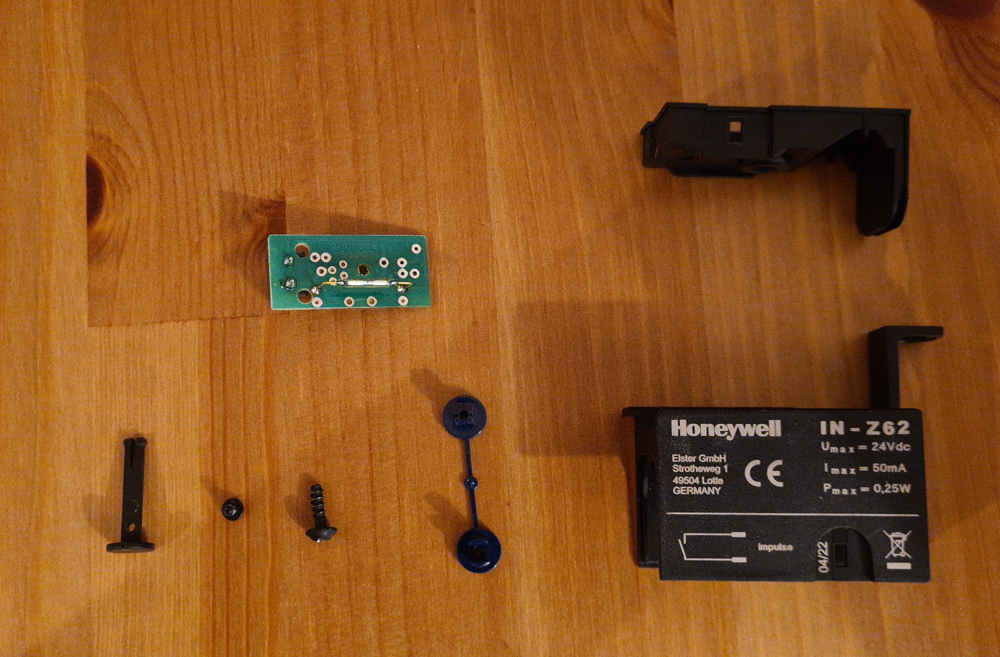
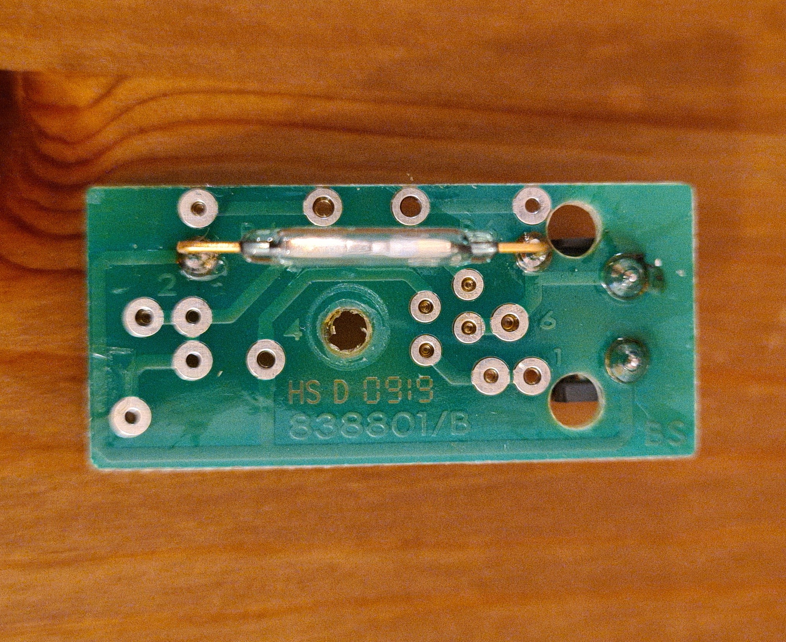
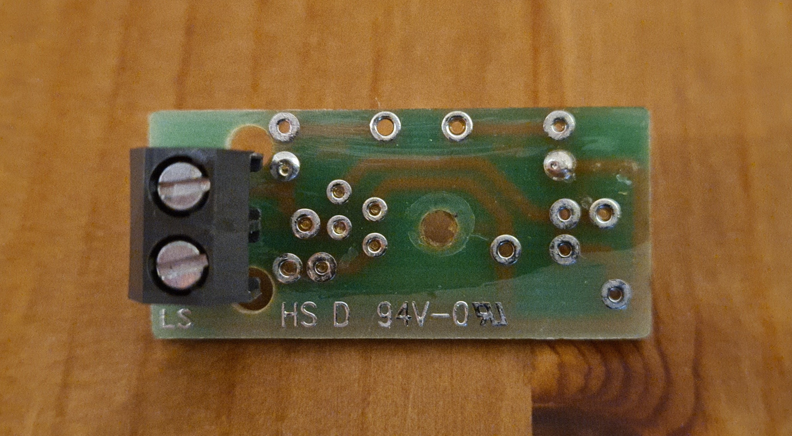

<!-- SPDX-License-Identifier: CC-BY-SA-4.0 -->

# Gas Meters

Our prime target is a [Kromschröder BK-4](https://docuthek.kromschroeder.com/download.php?lang=en&doc=64549). However, in principle, any meter with a magnetic reed switch interface
is supported.

## Sensors
Specifically for BK-4, native reed switches ([Honeywell IN-ZXX](https://process.honeywell.com/us/en/site/elster-instromet-de/produkte/gasmessung/balgengaszahler/in-z61))
are commercially available. When reusing a sensor, a new [plastic clip](https://gt-gascount.de/10-Stueck-Befestigungsclips-fuer-IN-Zxx) may be necessary.
      
The sensor consists of the reed switch *only* &mdash; there is *no* current limiting or debouncing electronics.

An electrically equivalent [3rd party solution](https://ng3d-druck.de/products/reedkontakt-sensor-bk-gaszaehler-esphome) is also available.
