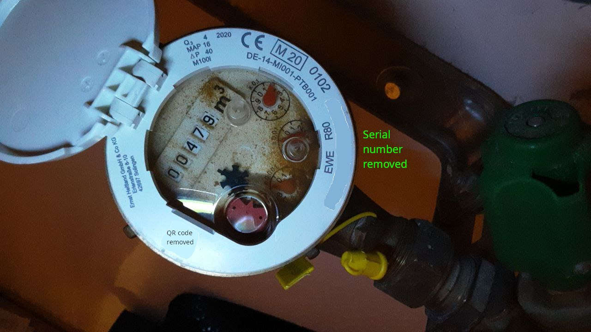

<!-- SPDX-License-Identifier: CC-BY-SA-4.0 -->

# Water Meters
Our prime target is an [Ernst Heitland’s M100i](https://prod-edam.honeywell.com/content/dam/honeywell-edam/pmt/hps/products/sme/water/residential-metering/multi-jet-meters/m100i/M100i-Datasheet-German.pdf). However, in principle, any meter with an inductive coupling interface is supported.

## Sensors
Specifically for M100i, a native sensor module ([Honeywell Falon MJ Puls/M-Bus Modul](https://prod-edam.honeywell.com/content/dam/honeywell-edam/pmt/hps/products/sme/water/digital-metering/wmbus/falcon-mj-pulse-mbus/D-Falcon20MJ-D-1407-0317.pdf)) is commercially available. Measurements are done by inductively locating the metallic half-disc mounted on the 100ml-counter with a three-coil setup. Sensor’s output is available as ISO-22158 shaped pulses or over the M-Bus (EN13757) interface. Compared to unfortunately incompatible [simple reed switches](https://prod-edam.honeywell.com/content/dam/honeywell-edam/pmt/hps/products/sme/water/residential-metering/multi-jet-meters/m190/M190-Mehrstrahlz-hler-Data-sheet-German.pdf), the module is therefore [quite costly](https://mysmartshop.de/products/honeywell-elster-falcon-mj-puls).

